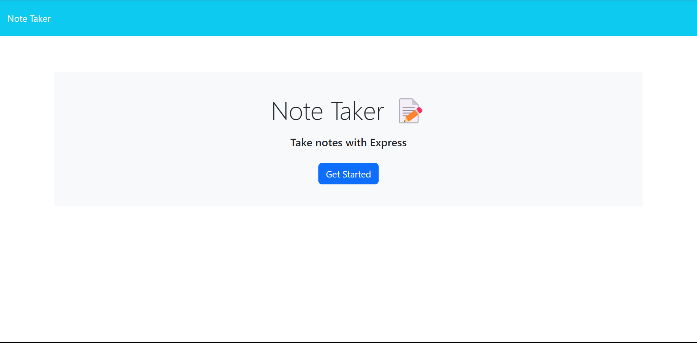

# Note Taker Application

Organize your thoughts and tasks with the Note Taker Application! 
This application provides a simple and intuitive interface for creating, saving, 
and managing notes, helping you stay productive and focused.



## Table of Contents

- [Features](#features)
- [Installation](#installation)
- [Usage](#usage)
- [API Routes](#api-routes)
- [Deployment](#deployment)
- [Contributing](#contributing)
- [License](#license)

## Features

- Create new notes with a title and content.
- Save notes for later reference and organization.
- View and edit existing notes.
- Delete notes that are no longer needed.

## Installation

1. Clone the repository:

   ```bash
   git clone https://github.com/didierthomasm/Awesome-Note-Taker.git
   cd note_taker
   
2. Install the dependencies:

    ```bash
    npm instal
   
3. Start the server

   ```bash
   npm start

## Usage

1. Access the Note Taker Application by opening your web browser and navigating to http://localhost:3001 or the provided URL.
2. Click on the "Get Started" button to access the notes page.
3. View existing notes listed on the left-hand column.
4. To create a new note, enter a title and content in the right-hand column. A "Save" icon will appear in the navigation bar.
5. Click on the "Save" icon to save your new note. It will appear in the left-hand column with other existing notes.
6. Click on an existing note to view its details.
7. To edit a note, make changes to the content and click the "Save" icon to update it.
8. To delete a note, click the trash icon next to the note in the list.

## API Routes

- `GET /api/notes`: Retrieve all saved notes as JSON.
- `POST /api/notes`: Save a new note. Requires a JSON object with `titleNote` and `note` properties.
- `DELETE /api/notes/:id`: Delete a note with the specified `id`.

## Deployment

The project is deployed on Heroku. You can access the live application at: [Note Taker App](https://your-heroku-app-url.herokuapp.com/)

## Contributing

Contributions are welcome! 
If you encounter any issues or have suggestions for improvements, 
please feel free to [create an issue](https://github.com/didierthomasm/Awesome-Note-Taker/issues) 
or [submit a pull request](https://github.com/didierthomasm/Awesome-Note-Taker).

## License

This project is licensed under the [MIT License](https://opensource.org/licenses/MIT).

[](https://opensource.org/licenses/MIT)
